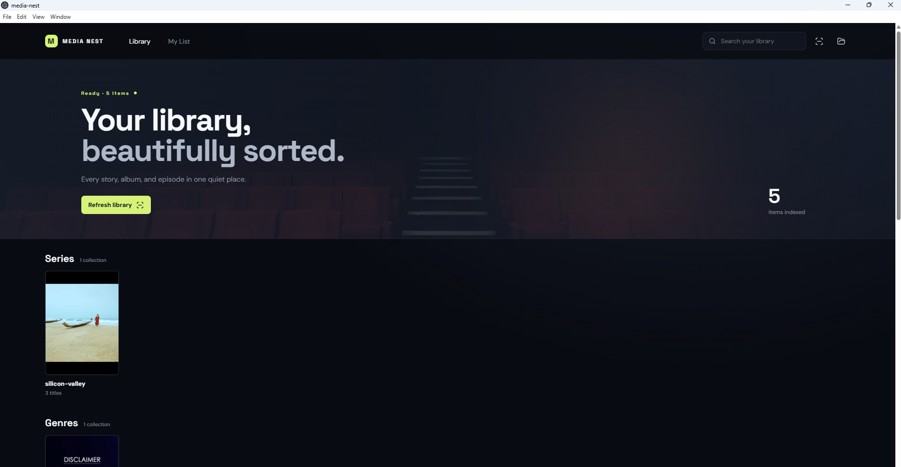
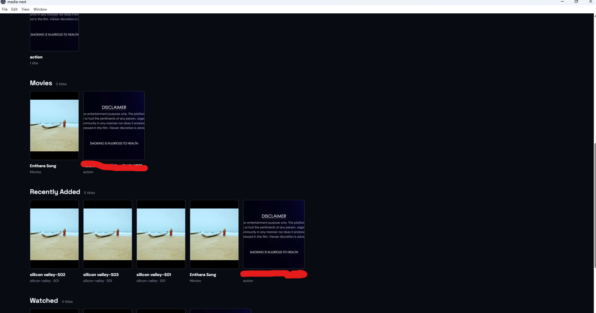

# Media Nest

Media Nest is a local-first media library app for organizing and browsing your movie, web series, and music collection from a single root folder.

Our objective is simple: avoid OTT apps like Netflix, Hotstar, youtube and similar streaming services by keeping your personal entertainment library on a local desktop application that is private, fast, and under your control.

It scans your chosen media directory, groups series by folder naming, categorizes genres by folder naming, and keeps everything local on your machine without needing a cloud service.

## How it works

After the app loads, choose a root folder for your media library.


## Screenshots







### Folder naming rules

- Web series folders should end with -series
  - Example: The Office-series
- Genre folders should end with -genre
  - Example: Action-genre
- Normal movies can be placed anywhere inside the selected folder
- Music files are also detected automatically and shown in the library

### Example structure

```text
MyMedia/
├── Action-genre/
│   ├── Inception.mp4
│   └── Dune.mkv
├── Silicon Valley-series/
│   ├── Season 1/
│   │   ├── Silicon Valley S01E01.mkv
│   │   └── Silicon Valley S01E02.mkv
│   └── Season 2/
│       └── Silicon Valley S02E01.mkv
├── Comedy-genre/
│   └── The Hangover.mp4
├── MyAlbum.mp3
├── Random Movie.mp4
└── Documentary-genre/
    └── Planet Earth.mp4
```

## Features

- Browse local media files from one chosen folder
- Detect and group web series automatically
- Group media by genre when folders are tagged with -genre
- Keep normal movies anywhere under the selected root
- Search by title, category, or series name
- Resume playback progress
- Support for audio and subtitle track selection
- Auto-generated poster thumbnails for video files
- Real-time library refresh when files change


## Development

Install dependencies:

```bash
npm install
```

Run the app in development mode:

```bash
npm run dev
```

This starts the Vite frontend and Electron app together.

## Packaging

Build the app for distribution:

```bash
npm run dist
```

This runs the build step and creates the Windows installer package.

## Notes

- The app is designed for Windows use.
- The root folder must be chosen inside the app UI before scanning begins.
- Folder names are parsed case-insensitively, so -series and -genre work regardless of capitalization.

## License

MIT

